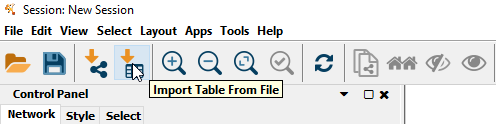
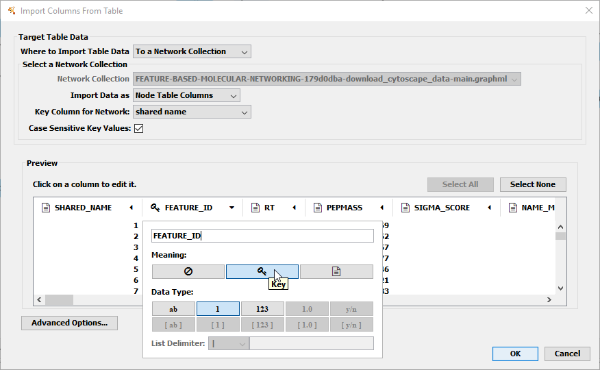

## Introduction

The main documentation for **Feature-Based Molecular Networking** (FBMN) [can be accessed here](featurebasedmolecularnetworking.md). See [our preprint on bioRxiv](https://www.biorxiv.org/content/10.1101/812404v1).

Below we describe how to use **MetaboScape** with the FBMN workflow on GNPS.

## Citations and development

This work builds on the efforts of our many colleagues, please cite their work:

Nothias, L.F. et al [Feature-based Molecular Networking in the GNPS Analysis Environment](https://www.biorxiv.org/content/10.1101/812404v1) bioRxiv 812404 (2019).

Wang, M. et al. [Sharing and community curation of mass spectrometry data with Global Natural Products Social Molecular Networking](https://doi.org/10.1038/nbt.3597). Nat. Biotechnol. 34, 828–837 (2016).

## Using MetaboScape and FBMN

MetaboScape can be used to process LC-MS/MS Bruker Daltonics data files (*.d or *.tdf files). After the processing with MetaboScape, the output files can be used to run the Feature-Based Molecular Networking workflow on GNPS either using the [Superquick FBMN start page](http://dorresteinappshub.ucsd.edu:5050/featurebasednetworking) or [the standard interface of the FBMN workflow](https://gnps.ucsd.edu/ProteoSAFe/index.jsp?params=%7B%22workflow%22:%22FEATURE-BASED-MOLECULAR-NETWORKING%22,%22library_on_server%22:%22d.speclibs;%22%7D) (you need to be logged in to GNPS first).

**Requirements:** 
Install [MetaboScape](https://www.bruker.com/products/mass-spectrometry-and-separations/ms-software/metaboscape/overview.html) (at least version 2.0) and get a valid license. 

### A. Perform Feature Detection with MetaboScape

1.	Open MetaboScape and create a new Bucket Table. If you are not familiar with this step, please follow the manual and tutorial found on the MetaboScape DVD.
2.	Do not forget to define groups and/or attributes to enhance downstream data analysis. The groups and/or attributes defined in MetaboScape will be visualized in the molecular networks using pie chart diagram.
3.	Once the bucket table is generated, you can use all the annotation tools provided by MetaboScape, e.g. spectral library matching or molecular formula annotation via SmartFormula.
4.	Select Export->Export for GNPS:

5.	Choose a directory for the output files and click “OK”:

6. The **MS/MS spectral summary** (.gnps.mgf file) and the **feature quantification table** (.msmsonly.csv file) will be used to perform a FBMN job on GNPS (see below).

#### Processing IMS Data (PASEF)

The FBMN supports Ion Mobility Spectrometry (IMS) Data acquired in data-dependent acquisition mode using Parallel Accumulation-Serial Fragmentation (PASEF) and processed with MetaboScape (ver. 5.0 or later). Process the IMS data following the MetaboScape documentation and do *Export to GNPS format* as indicated above. The  collission cross section (CCS) values and other annotations can be subsequently mapped in Cytoscape.

See a representative [FBMN job](https://gnps.ucsd.edu/ProteoSAFe/status.jsp?task=0d89db67b0974939a91cb7d5bfe87072) made from PASEF data (timsTOF Pro) processed with MetaboScape (ver. 5.0). The data files are available on the following MassIVE deposition ([MSV000084402](https://gnps.ucsd.edu/ProteoSAFe/result.jsp?task=36fea50f5e7b4a049d336f28c5884ff9&view=advanced_view))

### B. Perform FBMN Job on GNPS
Go to GNPS and perform a FBMN job. [Refer to that documentation](featurebasedmolecularnetworking.md). For metadata formats supported, see [this page](metadata.md)

Do not forget to use the .msmsonly.csv as **feature quantification table** and the .gnps.mgf file as the **MS2 input file**.

Use either the [Superquick FBMN start page](http://dorresteinappshub.ucsd.edu:5050/featurebasednetworking) or [the standard interface of the FBMN workflow](https://gnps.ucsd.edu/ProteoSAFe/index.jsp?params=%7B%22workflow%22:%22FEATURE-BASED-MOLECULAR-NETWORKING%22,%22library_on_server%22:%22d.speclibs;%22%7D).

### C. Map MetaboScape Annotation in Cytoscape
The generated network can be enriched by information from MetaboScape. To do so, select "Download Cytoscape Data" on the finished job and load the network into CytoScape. Then, select "Import Table From File":

Select the .msmsonly.csv file and on the import dialog, select the column "FEATURE_ID" as "Key" by selecting the column header:

Select "OK" and additional information from MetaboScape will now be present in the Node Table in CytoScape.

See the [step-by-step tutorial using MetaboScape 2.0 and the FBMN](tutorials/coffee-tutorial-metaboscape.md) for more details.

## Step-by-Step Tutorial
See the [step-by-step tutorial using MetaboScape 2.0 and the FBMN](tutorials/coffee-tutorial-metaboscape.md) for the Coffee tutorial (part of the **MetaboScape 2.0 documentation**).

### Join the GNPS Community !

- For feature request, or to report bugs, please open an "Issue" on the [*CCMS-UCSD/GNPS_Workflows* GitHub repository](https://github.com/CCMS-UCSD/GNPS_Workflows).
- To contribute to the GNPS documentation, please use GitHub by forking the [*CCMS-UCSD/GNPSDocumentation*](https://github.com/CCMS-UCSD/GNPSDocumentation) repository, and make a "Pull Request" with the changes.

## Page Contributions

{{ git_page_authors }}
